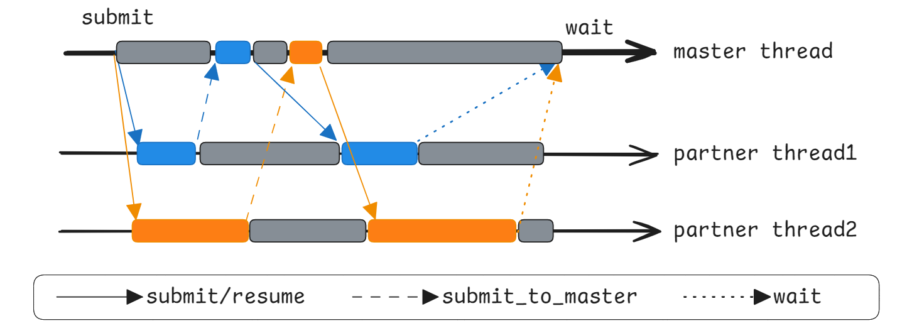

# Job Partner超低延时并发任务(C++)

## 概述

Job Partner支持两种方式提交任务，一种是**独立任务**执行，另一种是支持协程切出之后再次切回来的**协同任务**执行，该功能有以下特点：

- **NBG: Non-Blocking Guarantee 非阻塞保证**：细粒度任务调度中较大的一块开销是确保一定有工作线程执行该任务，该保证使得"确保一定有工作线程执行该任务"的开销由内核通信开销降低为原子指令的开销。
- **IE: Immediate Execution 立即执行**：数据由任务生产，如果获取数据时，任务尚未开始执行，则由任务消费者来执行，而不是等待调度器调度.本质是Compute-If-Absent的一种变体，能够提升即将被使用的任务的优先级。
- **ASF: Allow Submission Failure 允许提交失败**：任务的提交允许失败.

## 示例：某商城系统

举例实现一个某商城系统的节点并行化创建，节点的预创建，属性设置可以在ffrt线程上并行化执行，但是最终的节点组装需要js运行环境，需要在主线程上执行。


实现代码如下所示：

```cpp
#include <iostream>
#include <array>
#include "ffrt/cpp/pattern/job_partner.h"

namespace market_system {
    /**
    * 模拟js入参
    */
    void batchCreateNodes(std::array<int>& nodes)
    {
        const int job_num = nodes.size();
        auto agent = ffrt::job_partner<>::get_partner_of_this_thread();
        constexpr uint64_t stack_size = 16 * 1024;
        static std::array<char, stack_size> stack[job_num];
        agent->submit([&] {
            /**
            * 模拟ffrt处理node
            */
            ffrt::job_partner<>::submit_to_master([&] {
                /**
                * 模拟主线程处理node
                */
            });
            }, &stack[0], stack_size);
        agent->wait();
    }
};
```

## 接口说明

上述样例中涉及到主要的FFRT的接口包括：

| 名称                                                           | 描述               |
| -------------------------------------------------------------- | ------------------ |
| [submit](ffrt-api-guideline-cpp.md#submit_normal)              | 提交普通任务。     |
| [submit](ffrt-api-guideline-cpp.md#submit_cooperate)           | 提交协同任务。     |
| [wait](ffrt-api-guideline-cpp.md#wait)                         | 等待所有任务完成。 |
| [submit_to_master](ffrt-api-guideline-cpp.md#submit_to_master) | 任务提交到主线程。 |

## 约束限制

- 提交的任务必须是低延时高并发任务，不可以是高延时任务，否则执行队列容易堵塞，需要待消费之后才能再次提交。
- job partner底层使用的是无锁队列，队列深度一定，所以当生产速度大于消费速度的时候会导致队列塞满，此后再次提交任务，会出现失败的情况，此现象为合理现象，需要用户自行处理提交失败场景。
